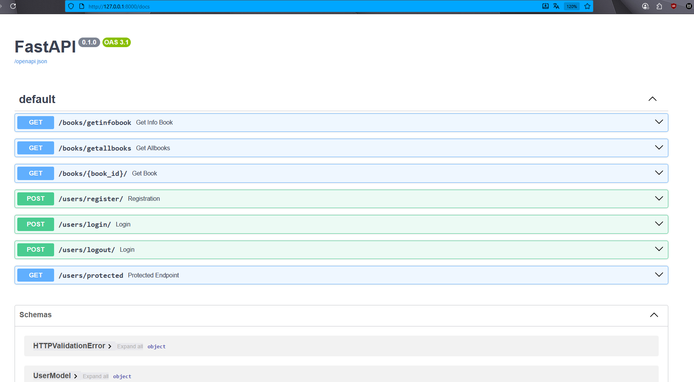

## Технологический стек
- ⚡ [**FastAPI**](https://fastapi.tiangolo.com) для Python backend API.
    - 🧰 [SQLAlchemy](https://www.sqlalchemy.org/) для взаимодействия с базой данных Python SQL (ORM).
    - 🔍 [Pydantic](https://docs.pydantic.dev), используется FastAPI для валидации данных.
    - 💾 [PostgreSQL](https://www.postgresql.org) база данных SQL.
- 🔒 Безопасное хеширование паролей по умолчанию.
- 🔑 Аутентификация JWT (JSON Web Token).
### Interactive API Documentation

